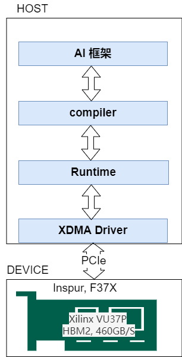
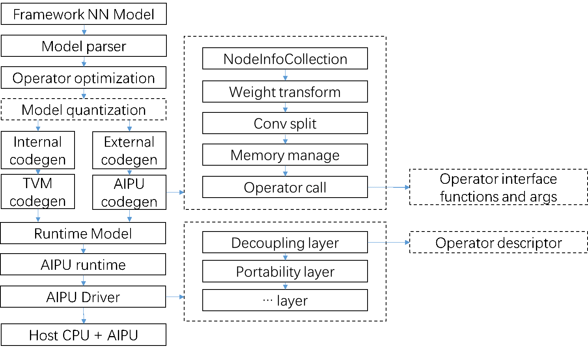
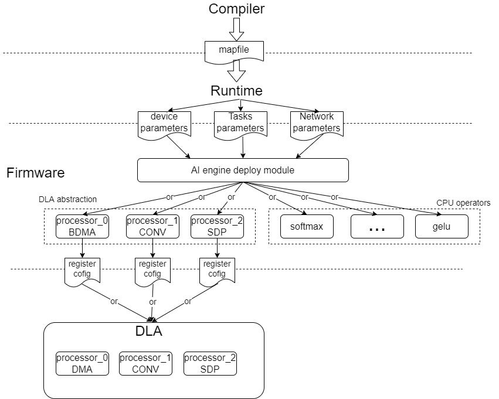
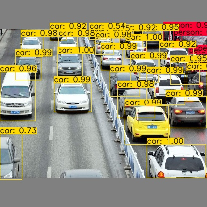

# LCAI-TIHU SOFTWARE

## Introduction

TIHU is an AI computing platform based on RISC-V instruction set. It provides software stack and hardware stack, and is a complete set of solutions that can verify different AI frameworks and AI algorithms.   

TIHU is designed based on a variety of open source projects, including cva6 (https://github.com/openhwgroup/cva6), ara (https://github.com/pulp-platform/ara), nvlda (https://github.com/nvdla),
xdma (https://github.com/Xilinx/dma_ip_drivers/tree/master/XDMA/linux-kernel) and TVM (https://github.com/apache/tvm), to explore the current AI open source ecology and accelerate the implementation of AI algorithms. 

In this project, we can explore RISC-V instruction set, deep-learning accelerator, AI compiler &  runtime, AI algorithms and AI frameworks.

Currently, TIHU only supports tensorflow. Pytorch will be supported very soon. Several CNN models have been tested on Inspur F37X card.

<div align=center>
<br/>
</div>

    
CNN models and accuracy  
| num | category | CNN model | TIHU(int8) accuracy | llvm(float) accuracy|
|---|----------------|-------|--------|------|
| 1 | classification | LeNet | 0.9884 | 0.992|
| 2 | classification | ResNet50 | 0.755 | 0.757|
| 3 | classification | MobileNetv2 | 0.71 | 0.72|
| 4 | classification | VGG16 | 0.627 | 0.629 |
| 5 | detection | YOLOv3 | 0.548 | 0.562|
| 6 | NLP | bert-base | - | - |

## TIHU software structure 
TIHU software include compiler, runtime, xdma driver and firmware.

<div align=center>
<br/>
</div>

Compiler and runtime are designed based on TVM and integrate the compiler and runtime of nvdla. Compiler consists of parser, optimizer, codegen, operator libraries.
CNN models are compiled into computing tasks with different device type and submitted to device by runtime. The host interacts with the device though PCIe drived by Xilinx xdma driver.

Firmware consists of dla driver and cpu operators. Firmware workflow can be found in README of firmware. 

At present, following operators are supported. Intrinsic operators will be done.

| category | operators |
|----------|-----------|
| convolution | Conv, Transposed Conv, Dilated Conv, Spatially Separable Conv, Depthwise Separable Conv, Grouped Convolution, Flattened Conv |
| activation | ReLU, ReLU6, P-ReLU, LeakyReLU, Sigmoid |
| fusion | CBR(Conv + BN + Relu), CB(Conv + BN) |
| pool | Max Pooling, Average Pooling, Upsample |
| dense | matrix multiplication, FC |
| Eltwise | Elemet-wise |
| other | Softmax, BatchNorm, Add, sub, div, multiply, power, slice, reshape, concate, expf, tanh, mean, cast, transpose, take, one_hot, expand, dense, batch_matmul, squeeze, resize, reduce, split, pool2D, etc. |

## TIHU software workflow

<div align=center>
<br/>
</div>

## Code structure

├── compiler_runtime: TIHU software, include compiler and runtime  
├── doc: TIHU user's guide  
├── firmware: TIHU SoC firmware  
├── xdma: driver and firmware download tools  
├── docker: docker file  
├── README.md  
└── LICENSE  

## Build procedure on ubuntu  

1. Build compiler and runtime without dockfile   
Install docker and then:  
```bash
$ sudo docker run -it --network=host -v /your/project/path/on/host:/workspace -v /dev:/dev --privileged=true --name your_docker_name docker_image_name:version /bin/bash # run docker and load ubuntu image
$ apt-get update
$ apt-get install -y python3 python3-dev python3-setuptools python3-pip python3-venv python-scipy gcc libtinfo-dev zlib1g-dev build-essential cmake libedit-dev libxml2-dev llvm-dev libjpeg-turbo8-dev git python3-pip autoconf
$ pip3 install -U pip -i https://pypi.tuna.tsinghua.edu.cn/simple
$ pip3 install numpy decorator attrs pytest scipy  opencv-python-headless tqdm pycocotools 
$ pip3 install keras==2.6.0 tensorflow==2.6.1  
$ git clone https://github.com/LCAI-TIHU/SW.git
$ cd SW/compiler_runtime && source env.sh
$ source build.sh

```

2. build compiler and runtime with dockefile   
We provide two versions of dockerfile, you can choose by yourself, which will have a positive effect on your build efficiency
```bash
$ git clone https://github.com/LCAI-TIHU/SW.git
$ cd SW/docker && sudo docker build -t tihu_software:v1 -f TIHU.Dockerfile .
$ sudo docker run -it --network=host -v /your/SW/path/:/workspace -v /dev:/dev --privileged=true --name tihu_software tihu_software:v1 /bin/bash
$ cd /workspace/SW/compiler_runtime
$ source env.sh && source build.sh 

```
# Build FPGA

# Quickstart

There are some samples in /SW/compiler_runtime/demo, before run you should:   
* Make sure the FPGA bitstream has been load, you can refer to HW project;  
* Make sure firmware has been compiled and downloaded, you can refer to ./firmware README;  
* Run docker and build compiler and runtime, make sure env.sh has been sourced;  
```bash
$ mkdir -p /workspace/mnist && cd /workspace/mnist
$ wget http://yann.lecun.com/exdb/mnist/t10k-images-idx3-ubyte.gz && gunzip t10k-images-idx3-ubyte.gz
$ wget http://yann.lecun.com/exdb/mnist/t10k-labels-idx1-ubyte.gz && gunzip t10k-labels-idx1-ubyte.gz
$ mkdir -p /workspace/tfmodel && cd /workspace/tfmodel
$ cp /workspace/SW/compiler_runtime/demo/lenet_test/frozen_lenet_3.pb ./
$ mkdir -p /worksapce/testimage && cd /worksapce/testimage
$ cp /workspace/SW/compiler_runtime/demo/lenet_test/00000_7.jpg ./
$ cd /workspace/SW/compiler_runtime/demo
$ python3 from_tensorflow_quantize_lenet.py 2>&1 | tee lenet.log

```   
This photo is the result of yolov3.

<div align=center>
<br/>
</div>

# Road Map   

# License

TIHU is licensed under the Apache-2.0 license. You may obtain a copy of the License at

 http://www.apache.org/licenses/LICENSE-2.0

