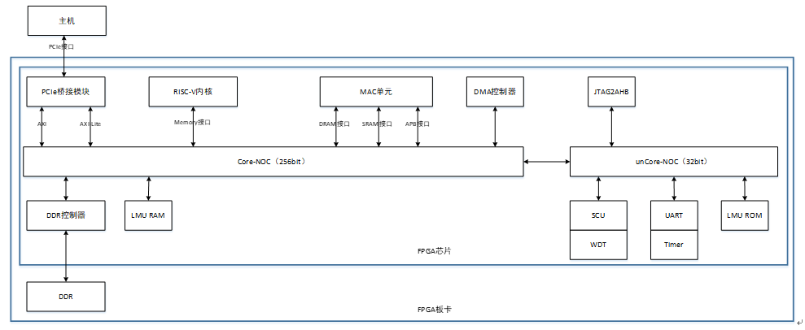
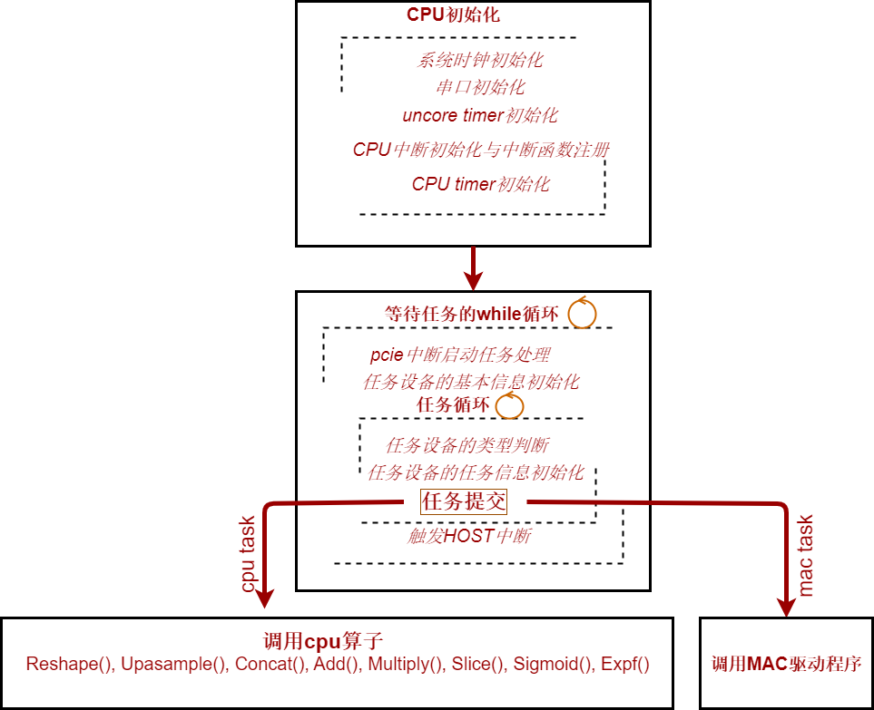

TIHU FIRMWARE
# Introduction
TIHU runs in barematel mode, and is driven by firmware to complete computing tasks submitted by RUNTIME. TIHU is comprised of RISC-V cpu, nvdla, NoC bus, PCIe module, DDR, SRAM, bootROM, DMA and peripherals.  

 

The workflow of TIHU is:  
* Initialize CPU clock, serial, timer and interrupt;    
* Wait for computing tasks submitted by RUNTIME;  
* RUNTIME submits task-list and address-list to TIHU, and raise PCIe interrupt to CPU;  
* Firmware assigns computing tasks to CPU or DLA based on device type;  
* Host interrupt will be raised when all tasks are completed;  

 

# Compile and Download
Riscv-gnu-toolchain should be downloaded to compile firmware.  
**Set PATH before compile firmware, or you will get error like "/bin/sh: 1: riscv64-unknown-elf-gcc: not found"**  
` sudo apt-get update && sudo apt-get upgrade -y && sudo apt-get install -y bzip2 rsync wget `  
` cd xxx/SW && wget https://static.dev.sifive.com/dev-tools/freedom-tools/v2020.12/riscv64-unknown-elf-toolchain-10.2.0-2020.12.8-x86_64-linux-ubuntu14.tar.gz `   
` tar xzf riscv64-unknown-elf-toolchain-10.2.0-2020.12.8-x86_64-linux-ubuntu14.tar.gz `  
` export PATH=$(pwd)/riscv64-unknown-elf-toolchain-10.2.0-2020.12.8-x86_64-linux-ubuntu14/bin:$PATH `  
` cd xxx/SW/firmware && make clean && make -j`

Download firmware.bin to DDR or SRAM.  
**Download address should be same with the address in link file.**  

` cd xxx/SW/xdma/tests && source download_firmware.sh `  

